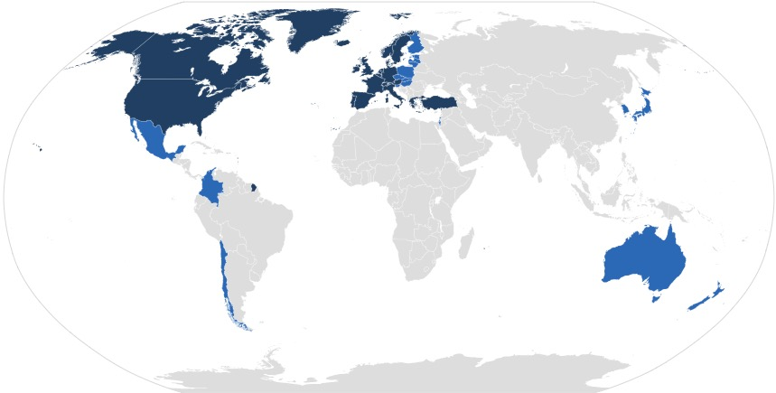

```{r setup, include=FALSE}
library(tidyverse)
library(kableExtra)
library(patchwork)

theme_set(theme_light(base_size = 30))
options(htmltools.dir.version = FALSE, echo = FALSE)
knitr::opts_chunk$set(echo = FALSE, fig.width = 12, fig.height = 8) 

data <- readr::read_csv(here::here("data", "df.csv"))
subsets <- readr::read_csv(here::here("data", "subsets.csv"))
```


# Research Question

* This study will focus on political freedom around the world. 

--

* We ask: What factors are associated with an increase in political freedom?.

--

* Observational study of political freedom as a function of social, economic, political factors.

--

* From Data provided by the Gapminder Foundation.

--

* filtered to only include OECD Countries from year 2000 to 2018 by necessity

---
class: center
# OECD




---
class: inverse, middle, center

# Data

---

# Political Freedom

- Freedomhouse quantifies Political Rights by 10 different indicators grouped in three subcategories.

--

1. Electoral Process

--

1. Political Participation and Pluralism

--

1. Discretionary Political rights. 

---


# Covariates  

- Corruption Perception Index Ranging from 0 to 100 with 0 being the most corruption perception.  

--

- Education Expenditure in GDP per Person

--

- Electricity use per person in Kilowatt Hours.

--

- Gini Coefficient. A measure of a nation's wealth inequality ranging from 0 being perfectly equal distribution of income and 1 being one person has all nation's wealth. 

--

- Percentage of population That use the Internet.

--

- Labor Force Participation.

--

- Life Expectancy

--

- Military Spending as a percentage of GDP

--

- Murders per million people. 

---

class: center
# Inputing Median

```{r}
set.seed(69)
t1 <- cbind(1:5, round(runif(5, 200, 300), 2))
t1[3,2] <- NA
t2 <- t1
colnames(t1) <- c("Obs. Number", "Data Point")
t2[3,2] <- median(t1[,2], na.rm = TRUE)
colnames(t2) <- c("Obs. Number", "Data Point")
knitr::kable(list(t1, t2), caption = "Illustrated Example")
```

$$Median = 264.98$$
---
class: inverse, middle, center

# Summary Statistics
---

```{r message=FALSE}
data %>% 
  group_by(country) %>% 
summarise(across(.cols = c(corruption_perception_index_cpi:murder_per_mil_people), mean)) %>% 
  mutate_if(is.numeric, round, 2) %>% 
  kable(
    col.names = c("Country", "CPI", "Edu Exp", "Electric Use", "Gini", "Internet Users", "Labor Force", "Life Expectancy","Military Spending", "Murder Rate")) %>% 
  kable_styling(bootstrap_options = c("striped", "hover", "condensed", "responsive"), font_size = 6, fixed_thead = T)
```

---
class: center, middle
```{r}
lab <- data %>% 
  group_by(polrights_fh) %>% 
  add_count(polrights_fh) %>% 
  distinct(n)

data %>% 
  group_by(polrights_fh) %>% 
  add_count(polrights_fh) %>% 
  ggplot(aes(x = polrights_fh, fill = factor(polrights_fh)), color = "black") + 
  geom_bar() + 
  geom_text(data = lab, aes(x = polrights_fh, y = n, label = n), vjust = -.75) + 
  viridis::scale_fill_viridis(discrete = TRUE, direction = -1) +
  scale_x_continuous(breaks = 1:7) + 
  theme_test(base_size = 30) + 
  theme(legend.position = "none") + 
  labs(y = "Number", x = "Political Freedom", title = "Distribution of Political Freedom Within the OECD")
```

---

# Assumptions

--
* Finite mean and sd
* independance
* Linearity
* Normaily
* Homoskidasticity

---

# Best Subsets by Adjusted R Squared
```{r message=FALSE}
subsets %>% 
  group_by(df) %>% 
  filter(adj.r.squared == max(adj.r.squared)) %>% 
  mutate_if(is.numeric, round, 3) %>% 
  rename(a_rsq = adj.r.squared) %>% 
  select(df, a_rsq, model) %>% 
  arrange(desc(a_rsq)) %>% 
DT::datatable(fillContainer = FALSE, options = list(pageLength = 3), 
              colnames = c("DF", "A_Rsq", "Model"))
```

---
# Best Subsets by AIC
```{r message=FALSE}
subsets %>% 
  group_by(df) %>% 
  filter(AIC == min(AIC)) %>% 
  mutate_if(is.numeric, round, 3) %>% 
  select(df, AIC, model) %>% 
  arrange(AIC) %>% 
DT::datatable(fillContainer = FALSE, options = list(pageLength = 3),
              colnames = c("DF", "AIC", "Model"))
```

---

# Best Subsets by BIC
```{r message=FALSE}
subsets %>% 
  group_by(df) %>% 
  filter(BIC == min(BIC)) %>% 
  mutate_if(is.numeric, round, 3) %>% 
  select(df, BIC, model) %>% 
  arrange(BIC) %>% 
DT::datatable(fillContainer = FALSE, options = list(pageLength = 3),
              colnames = c("DF", "BIC", "Model"))
```

---

class: center, middle

# Best Subsets

```{r, message=FALSE, warning=FALSE, fig.width=12, fig.height=8}
r <- subsets %>% group_by(df) %>% summarise(adj = max(adj.r.squared, na.rm = T))

subsets %>% 
  ggplot(aes(x = df, y = adj.r.squared)) + 
  geom_point() + 
  geom_smooth(data = r, aes(df, adj), se = FALSE, span = 0.5, color = "Green") + 
  labs(title = "", x = "Parameters", y = "Adjusted R Squared") + 
  scale_x_continuous(breaks = 1:9) + 
  theme_test(base_size = 30)
```

---
class: center, middle

# Best Subsets

```{r, message=FALSE, warning=FALSE, fig.width=12, fig.height=8}
r <- subsets %>% group_by(df) %>% summarise(AIC = max(AIC, na.rm = T))

subsets %>% 
  ggplot(aes(x = df, y = AIC)) + 
  geom_point() + 
  geom_smooth(data = r, aes(df, AIC), se = FALSE, span = 0.5, color = "red") + 
  labs(title = "", x = "Parameters", y = "AIC") + 
  scale_x_continuous(breaks = 1:9) + 
  theme_test(base_size = 30)
```

---

class: inverse, middle, center

# Model

---

class: center, middle
```{r}
model_df5_formula <- subsets %>% filter(df == 5) %>% 
  arrange(desc(adj.r.squared)) %>% 
  select(model) %>% head(1) %>% as.character()

fit_df5 <- lm(model_df5_formula, data)
```


```{r include=FALSE}
equatiomatic::extract_eq(model = fit_df5, intercept = "beta", terms_per_line = 1)
```

$$
\large
\begin{align}
\operatorname{polrights} = \beta_{0} + \beta_{1}(\operatorname{corruption\_perception\_index\_cpi}) +\\ \beta_{2}(\operatorname{edu\_exp\_gdp\_per\_person}) +\\ \beta_{3}(\operatorname{life\_expectancy\_years}) +\\ \beta_{4}(\operatorname{military\_spending\_pct\_of\_gdp}) +\\ \beta_{5}(\operatorname{murder\_per\_mil\_people}) + \epsilon
\end{align}
$$
---
class: center

$$
\small
\begin{align}
\operatorname{polrights} = \beta_{0} + \beta_{1}(\operatorname{corruption\_perception\_index\_cpi}) +\\ \beta_{2}(\operatorname{edu\_exp\_gdp\_per\_person}) +\\ \beta_{3}(\operatorname{life\_expectancy\_years}) +\\ \beta_{4}(\operatorname{military\_spending\_pct\_of\_gdp}) +\\ \beta_{5}(\operatorname{murder\_per\_mil\_people}) + \epsilon
\end{align}
$$

```{r}
broom::tidy(fit_df5) %>% 
  mutate(p.value = as.character(p.value)) %>%
  mutate_if(is.numeric, round, 3) %>% 
  mutate(p.value = as.numeric(p.value)) %>% 
  kable(col.names = c("Term", "Estimate", "Std. Error", "T-Stat", "P-Value")) 
```

***
```{r}
broom::glance(fit_df5) %>% 
  select(r.squared, adj.r.squared, adj.r.squared, AIC, BIC) %>% 
  mutate_if(is.numeric, round, 3) %>% 
  kable()
```

---
class: center
$$
\small
\begin{align}
\operatorname{polrights} = \beta_{0} + \beta_{1}(\operatorname{corruption\_perception\_index\_cpi}) +\\ \beta_{2}(\operatorname{edu\_exp\_gdp\_per\_person}) +\\ \beta_{3}(\operatorname{life\_expectancy\_years}) +\\ \beta_{4}(\operatorname{military\_spending\_pct\_of\_gdp}) +\\ \beta_{5}(\operatorname{murder\_per\_mil\_people}) + \epsilon
\end{align}
$$
```{r}
broom::tidy(fit_df5) %>% 
  mutate(p.value = as.character(p.value)) %>%
  mutate_if(is.numeric, round, 3) %>% 
  mutate(p.value = as.numeric(p.value)) %>% 
  kable(col.names =  c("Term", "Estimate", "Std. Error", "T-Stat", "P-Value"))  %>% 
  row_spec(2, color = "white", background = "#D7261E")
```

***

```{r}
broom::glance(fit_df5) %>% 
  select(r.squared, adj.r.squared, adj.r.squared, AIC, BIC) %>% 
  mutate_if(is.numeric, round, 3) %>% 
  kable()
```


---
class: center
$$
\small
\begin{align}
\operatorname{polrights} = \beta_{0} + \beta_{1}(\operatorname{corruption\_perception\_index\_cpi}) +\\ \beta_{2}(\operatorname{edu\_exp\_gdp\_per\_person}) +\\ \beta_{3}(\operatorname{life\_expectancy\_years}) +\\ \beta_{4}(\operatorname{military\_spending\_pct\_of\_gdp}) +\\ \beta_{5}(\operatorname{murder\_per\_mil\_people}) + \epsilon
\end{align}
$$
```{r}
broom::tidy(fit_df5) %>% 
  mutate(p.value = as.character(p.value)) %>%
  mutate_if(is.numeric, round, 3) %>% 
  mutate(p.value = as.numeric(p.value)) %>% 
  kable(col.names =  c("Term", "Estimate", "Std. Error", "T-Stat", "P-Value")) %>% 
  row_spec(3, color = "white", background = "#D7261E")
```

***

```{r}
broom::glance(fit_df5) %>% 
  select(r.squared, adj.r.squared, adj.r.squared, AIC, BIC) %>% 
  mutate_if(is.numeric, round, 3) %>% 
  kable()
```


---
class: center
$$
\small
\begin{align}
\operatorname{polrights} = \beta_{0} + \beta_{1}(\operatorname{corruption\_perception\_index\_cpi}) +\\ \beta_{2}(\operatorname{edu\_exp\_gdp\_per\_person}) +\\ \beta_{3}(\operatorname{life\_expectancy\_years}) +\\ \beta_{4}(\operatorname{military\_spending\_pct\_of\_gdp}) +\\ \beta_{5}(\operatorname{murder\_per\_mil\_people}) + \epsilon
\end{align}
$$
```{r}
broom::tidy(fit_df5) %>% 
  mutate(p.value = as.character(p.value)) %>%
  mutate_if(is.numeric, round, 3) %>% 
  mutate(p.value = as.numeric(p.value)) %>% 
  kable(col.names =  c("Term", "Estimate", "Std. Error", "T-Stat", "P-Value")) %>% 
  row_spec(4, color = "white", background = "#D7261E")
```

***

```{r}
broom::glance(fit_df5) %>% 
  select(r.squared, adj.r.squared, adj.r.squared, AIC, BIC) %>% 
  mutate_if(is.numeric, round, 3) %>% 
  kable()
```


---

class: center
$$
\small
\begin{align}
\operatorname{polrights} = \beta_{0} + \beta_{1}(\operatorname{corruption\_perception\_index\_cpi}) +\\ \beta_{2}(\operatorname{edu\_exp\_gdp\_per\_person}) +\\ \beta_{3}(\operatorname{life\_expectancy\_years}) +\\ \beta_{4}(\operatorname{military\_spending\_pct\_of\_gdp}) +\\ \beta_{5}(\operatorname{murder\_per\_mil\_people}) + \epsilon
\end{align}
$$
```{r}
broom::tidy(fit_df5) %>% 
  mutate(p.value = as.character(p.value)) %>%
  mutate_if(is.numeric, round, 3) %>% 
  mutate(p.value = as.numeric(p.value)) %>% 
  kable(col.names =  c("Term", "Estimate", "Std. Error", "T-Stat", "P-Value")) %>% 
  row_spec(5, color = "white", background = "#D7261E")
```

***

```{r}
broom::glance(fit_df5) %>% 
  select(r.squared, adj.r.squared, adj.r.squared, AIC, BIC) %>% 
  mutate_if(is.numeric, round, 3) %>% 
  kable()
```

---

class: center
$$
\small
\begin{align}
\operatorname{polrights} = \beta_{0} + \beta_{1}(\operatorname{corruption\_perception\_index\_cpi}) +\\ \beta_{2}(\operatorname{edu\_exp\_gdp\_per\_person}) +\\ \beta_{3}(\operatorname{life\_expectancy\_years}) +\\ \beta_{4}(\operatorname{military\_spending\_pct\_of\_gdp}) +\\ \beta_{5}(\operatorname{murder\_per\_mil\_people}) + \epsilon
\end{align}
$$
```{r}
broom::tidy(fit_df5) %>% 
  mutate(p.value = as.character(p.value)) %>%
  mutate_if(is.numeric, round, 3) %>% 
  mutate(p.value = as.numeric(p.value)) %>% 
  kable(col.names =  c("Term", "Estimate", "Std. Error", "T-Stat", "P-Value")) %>% 
  row_spec(6, color = "white", background = "#D7261E")
```

***

```{r}
broom::glance(fit_df5) %>% 
  select(r.squared, adj.r.squared, adj.r.squared, AIC, BIC) %>% 
  mutate_if(is.numeric, round, 3) %>% 
  kable()
```

---

class: center, middle

```{r warning=FALSE}

hist <- fit_df5 %>% 
  broom::augment() %>% 
  ggplot(aes(.resid)) + 
  geom_histogram(bins = 100, fill = "black") +
  scale_x_continuous(limits = c(-4,4)) + labs(y = "Density", x = "Residual", title = "Histogram")


qq <- fit_df5 %>% 
  broom::augment() %>% 
  ggplot(aes(sample = .resid)) + 
  stat_qq() +
  stat_qq_line() + 
scale_x_continuous(limits = c(-4,4)) + 
scale_y_continuous(limits = c(-4,4)) + labs(title = "QQ Plot of Residuals ", x = "Residual", y = "Expected")
```

```{r}
hist + qq
```

---
class: center, middle

```{r}
outliars <- fit_df5 %>% 
  broom::augment() %>% 
  filter(.resid < -4*sd(.resid))

labeled_outliars <- hist +
  geom_point(outliars, mapping = aes(x = .resid, y = 1), color = "#D7261E", shape = 13, size = 10) + 
  geom_label(outliars, mapping = aes(x = -3.3, y = 5, label = "OUTLIARS"), color = "#D7261E", size = 3)

labeled_qq <- qq + geom_point(outliars, mapping = aes(x = -3, y = -3.9), color = "#D7261E", shape = 0, size = 15) +
                   geom_point(outliars, mapping = aes(x = -2.6, y = -2.7), color = "#D7261E", shape = 0, size = 15) +
                   geom_label(outliars, mapping = aes(x = -3, y = -3.5, label = "OUTLIARS"), color = "#D7261E", size = 3)

```

```{r message=FALSE}
labeled_outliars + labeled_qq
```
---

```{r}
fit_df5 %>% 
  broom::augment() %>% 
  mutate(yhat = predict(fit_df5),
         resid = resid(fit_df5)) %>% 
  ggplot() + 
  geom_point(aes(x = yhat, y = resid)) + 
  geom_hline(yintercept = 0, color = "red") + 
  scale_y_continuous(limits = c(-4,4)) + 
  labs(y = "Residual", x = "Predicted Value")
```

---

```{r}
broom::tidy(fit_df5) %>% 
  mutate(p.value = as.character(p.value)) %>%
  mutate_if(is.numeric, round, 3) %>% 
  mutate(p.value = as.numeric(p.value)) %>% 
  kable(col.names =  c("Term", "Estimate", "Std. Error", "T-Stat", "P-Value"),
        caption = "Included Outliers") 
```

***

```{r}
data %>% 
  filter(polrights_fh >= 4) %>% 
  lm(model_df5_formula, .) %>% 
  broom::tidy() %>% 
  mutate(p.value = as.character(p.value)) %>%
  mutate_if(is.numeric, round, 3) %>% 
  mutate(p.value = as.numeric(p.value)) %>% 
  kable(col.names =  c("Term", "Estimate", "Std. Error", "T-Stat", "P-Value"),
        caption = "Removed Outliers") 
```

---

```{r}
broom::tidy(fit_df5) %>% 
  mutate(p.value = as.character(p.value)) %>%
  mutate_if(is.numeric, round, 3) %>% 
  mutate(p.value = as.numeric(p.value)) %>% 
  kable(col.names =  c("Term", "Estimate", "Std. Error", "T-Stat", "P-Value"),
        caption = "Included Outliers") %>% 
  row_spec(3, color = "white", background = "#D7261E")
```

***

```{r}
data %>% 
  filter(polrights_fh >= 4) %>% 
  lm(model_df5_formula, .) %>% 
  broom::tidy() %>% 
  mutate(p.value = as.character(p.value)) %>%
  mutate_if(is.numeric, round, 3) %>% 
  mutate(p.value = as.numeric(p.value)) %>% 
  kable(col.names =  c("Term", "Estimate", "Std. Error", "T-Stat", "P-Value"),
        caption = "Removed Outliers") %>% 
  row_spec(3, color = "white", background = "#D7261E")
```

---
```{r, animation.hook="gifski", interval = .1}
for(i in 1:(nrow(data))/5){
plot(data$electricity_use_per_person[1:i*5], resid(fit_df5)[1:i*5], xlim=c(0,6000), ylim = c(-4, 1.25))
}

```

---

# Discussion of outliers

- We identified these outliers.
- confirmed they are not errors. 
- decided to keep them because They are indicating a substancial loss in political freedom which falls outside of the scope of the model. However, is important for our reserach Q.
***
> A safe rule frequently suggested is to discard an outlier only if there is direct evidence that it represents an error in recording, a miscalculation, a malfunctioning of equipment, or a similar type of circumstance. -Chapter 3 p.108


---

# Brown Forsythe Test

```{r}
df <- data %>% 
  mutate(predict = predict(fit_df5),
               e = resid(fit_df5)) %>% 
  arrange(predict)

lower <- df %>% filter(predict < quantile(predict, .5)) %>% arrange(predict)
upper <- df %>% filter(predict >= quantile(predict, .5)) %>% arrange(desc(predict))

d1 <- mean(abs(lower$e - median(lower$e)))
d2 <- mean(abs(upper$e - median(upper$e)))

s <- sum((abs(lower$e - median(lower$e)) - d1)^2) +
     sum((abs(upper$e - median(upper$e)) - d2)^2)
sq <- s / (nrow(df) - 2)
s <- sqrt(sq)
sq <- sqrt((1/nrow(lower)) + (1/nrow(upper)))
tstar <- (d1 - d2) / (s*sq)
# qt(p = .975, 79)
# c(d1, d2, s, tstar)
```

$$ 
\begin{align}
d_{{i1}}=\left\vert e_{{i1}}-{\tilde  {e}}_{1}\right\vert  \quad  \quad  \quad  \quad d_{{i2}}=\left\vert e_{{i2}}-{\tilde  {e}}_{2}\right\vert \\
\end{align}
$$
***

$$ 
\begin{align}
\bar{d_{{1}}}= 0.489 \quad  \quad \quad  \quad  \quad \bar{d_{{2}}}=0.177 \\
\end{align}
$$
*** 

$$
\begin{align}
{\displaystyle t^{*}_{BF} ={\frac {{\bar {d}}_{1}-{\bar {d}}_{2}}{s^2 {\sqrt {{\frac {1}{n_{1}}}+{\frac {1}{n_{2}}}}}}}}
\end{align}
$$
***

$$
\begin{align}
{\displaystyle t^{*}_{BF} ={\frac {0.489 -{0.177}}{0.176 {\sqrt {{\frac {1}{324}}+{\frac {1}{324}}}}}}} = 9.49
\end{align}
$$

$$
\begin{align}
t(.975; 643) = 1.963
\end{align}
$$
- Conclude Error variance is not constant

---

# Brown Forsythe Test Dropping Outliars

```{r}
df <- data %>% 
  mutate(predict = predict(fit_df5),
               e = resid(fit_df5)) %>% 
  filter(polrights_fh >= 4) %>% 
  arrange(predict)

lower <- df %>% filter(predict < quantile(predict, .5)) %>% arrange(predict)
upper <- df %>% filter(predict >= quantile(predict, .5)) %>% arrange(desc(predict))

d1 <- mean(abs(lower$e - median(lower$e)))
d2 <- mean(abs(upper$e - median(upper$e)))

s <- sum((abs(lower$e - median(lower$e)) - d1)^2) +
     sum((abs(upper$e - median(upper$e)) - d2)^2)
sq <- s / (nrow(df) - 2)
s <- sqrt(sq)
sq <- sqrt((1/nrow(lower)) + (1/nrow(upper)))
tstar <- (d1 - d2) / (s*sq)
# qt(p = .975, 79)
# c(d1, d2, s, tstar)
```

$$ 
\begin{align}
d_{{i1}}=\left\vert e_{{i1}}-{\tilde  {e}}_{1}\right\vert  \quad  \quad  \quad  \quad d_{{i2}}=\left\vert e_{{i2}}-{\tilde  {e}}_{2}\right\vert \\
\end{align}
$$
***

$$ 
\begin{align}
\bar{d_{{1}}}= 0.447 \quad  \quad \quad  \quad  \quad \bar{d_{{2}}}=0.176 \\
\end{align}
$$
*** 

$$
\begin{align}
{\displaystyle t^{*}_{BF} ={\frac {{\bar {d}}_{1}-{\bar {d}}_{2}}{s^2 {\sqrt {{\frac {1}{n_{1}}}+{\frac {1}{n_{2}}}}}}}}
\end{align}
$$
***

$$
\begin{align}
{\displaystyle t^{*}_{BF} ={\frac {0.447 -{0.176}}{0.176 {\sqrt {{\frac {1}{322}}+{\frac {1}{322}}}}}}} = 10.274
\end{align}
$$

$$
\begin{align}
t(.975; 639) = 1.963
\end{align}
$$
- Conclude again Error variance is not constant even when outliars are removed

---
# Conclusions

1. we think this
1. because

---
class: center, middle

# Thanks You and We are Happy to Take Questions

Slides created via the R package [**xaringan**](https://github.com/yihui/xaringan).

---

```{r}
model_df6_formula <- subsets %>% filter(df == 6) %>% 
  arrange(desc(adj.r.squared)) %>% 
  select(model) %>% head(1) %>% as.character() 

fit_df6 <- lm(model_df6_formula, data)

model_df4_formula <- subsets %>% filter(df == 4) %>% 
  arrange(desc(adj.r.squared)) %>% 
  select(model) %>% head(1) %>% as.character() 

fit_df4 <- lm(model_df4_formula, data)

model_df3_formula <- subsets %>% filter(df == 3) %>% 
  arrange(desc(adj.r.squared)) %>% 
  select(model) %>% head(1) %>% as.character() 

fit_df3 <- lm(model_df3_formula, data)

```

<font size="2">
```{r results='asis'}
stargazer::stargazer(fit_df6, fit_df5, fit_df4, fit_df3, type = "html", 
                     title = "Regression Results", 
                     covariate.labels = c(),
                     header = FALSE,
                     single.row = TRUE)
```